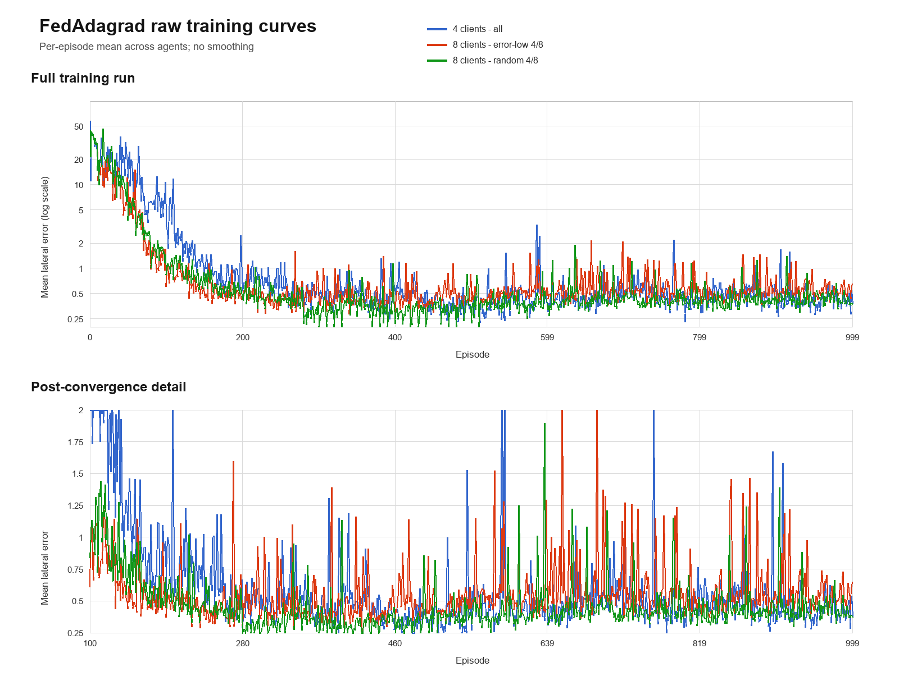

# Experiment results

## Raw learning curves

The curves show the per-episode mean lateral error across participating agents. No moving average or other smoothing is applied.

## Training time

| Experiment | Started | Finished | Wall-clock time | Mean round time |
| --- | --- | --- | ---: | ---: |
| 4 clients, all 4/4 | 2026-09-16 17:22:01 | 2026-09-16 19:30:01 | 2 h 8 min | 89.8 s during parallel phase |
| 8 clients, error-low 4/8 | 2026-09-16 17:44:43 | 2026-09-16 20:33:12 | 2 h 48 min 29 s | 100.5 s |
| 8 clients, random 4/8 | 2026-09-16 17:44:52 | 2026-09-16 20:33:16 | 2 h 48 min 24 s | 100.5 s |

The full experiment suite took approximately 3 hours 11 minutes of wall-clock time. The three individual durations total approximately 7 hours 45 minutes, but the two 8-client experiments and the final 700 episodes of the 4-client experiment ran concurrently.

Each experiment consisted of 100 federated rounds with 10 episodes per round. The 8-client runs spent about 167.5 minutes inside worker execution and approximately one additional minute on aggregation, metrics, checkpointing, and final model export.

The 4-client run completed its first 300 episodes before the parallel launcher was started. Its round time increased from approximately 44 seconds while running alone to 89.8 seconds during the shared-GPU phase. This reflects GPU contention rather than a change in the learning algorithm.

## Interpretation

- Error-low and random client selection have effectively identical execution costs.
- Parallel execution substantially reduced user waiting time, although it increased the duration of each individual round.
- Timing values are measured from training logs and filesystem timestamps on the experiment machine.
- The 4-client log was reopened when the run resumed at episode 300, so its complete duration is taken from experiment creation and final-model timestamps; its logged mean covers the final 70 rounds.

